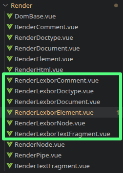
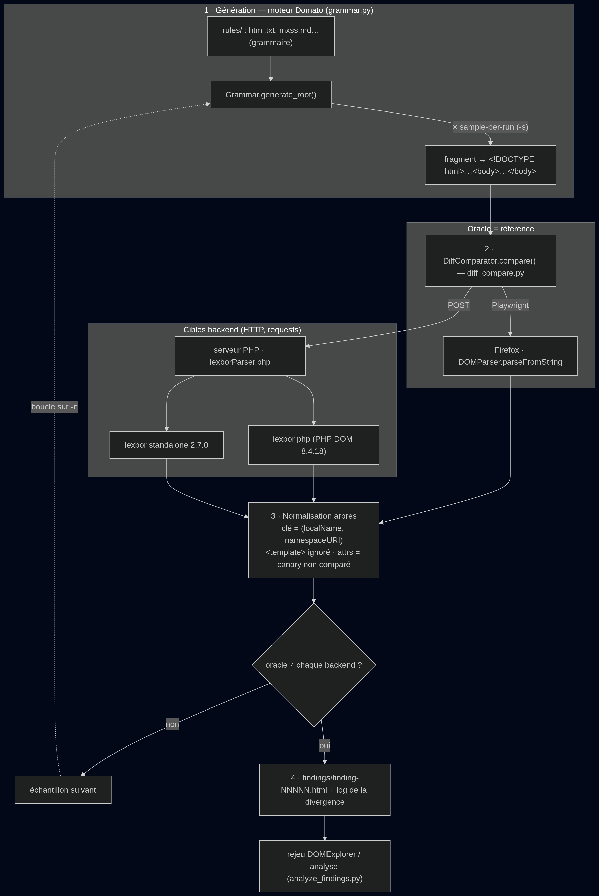

+++
title = "Explorer la spécification HTML : Les outils (3/4)"
date = "2026-06-25"
template = "page.html"
+++
## Introduction

Lors des deux précédents articles, nous avons pu aborder une partie de la spécification HTML. Le but est de comprendre les mutation HTML qui peuvent conduire à des XSS, et de mettre à profit ces connaissances pour étudier la librairie HTML Sanitizer de Symfony.

Mais notons une chose : Symfony est une librairie PHP, c'est à dire un langage de programmation `backend` qui, au contraire du javascript, n'est pas exécuté par un navigateur. 

Son rôle, c'est de traiter la logique d'une application donnée, de générer du HTML, communiquer avec une base de données etc.

Ce trait a une conséquence : on ne peut pas utiliser **DOMExplorer** tel qu'il nous est fourni, car cette application est sciemment limitée aux navigateurs.

Dès lors, pour notre apprentissage, il était nécessaire de mettre en place une version backend de DOMExplorer : DOMExplorer Edition Code Spaghetti.

Cela a été le premier outil implémenté et c'est le premier que nous allons aborder.

Mais, nous l'avons vu, si DOMExplorer possède certaines qualités nécessaires à l'étude des mutations HTML, il ne fait pour autant pas tout. Construire des payloads est un travail fastidieux.

Il est difficile, en effet, de penser à l'ensemble des problèmes qui pourraient survenir dans un parseur HTML, eût égard à la complexité de ces programmes, où des bugs peuvent être profondément insérés dans une base de code gigantesque.

Or, les mutations surviennent parfois dans ces conditions exotiques. L'automatisation devient dès lors souhaitable.

Mais comment automatiser une telle classe de vulnérabilité ? S'il existe bien des [programmes](https://wpt.fyi/results/domparsing?label=master&label=experimental&aligned) pour tester la conformité d'un agent utilisateur à la spécification HTML, il n'y a rien de spécifique - toujours à ma connaissance - concernant les mutations ([hormis quelques tests](https://wpt.fyi/results/domparsing/innerhtml-mxss.sub.html?label=master&label=experimental&aligned)).

Il s'agissait alors de trouver une façon de se faciliter la vie sans non plus développer quelque chose de 0. En cherchant sur les internets, un programme qui date de 2017 est ressorti : [domato](https://github.com/googleprojectzero/domato). Ce fuzzer HTML visait à faire casser les rendus des moteurs graphiques des navigateurs.

On peut donc repartir de ce programme afin de l'adapter à l'usage qu'on souhaite en faire.

Ce travail, long et fastidieux, a été mené avec une IA. Une rapide vue générale de l'utilisation de cet outil au long de ce projet constituera le dernier chapitre de cet article.

Petite mise en garde: cet article concerne principalement de la programmation informatique, et n'est pas nécessaire à la compréhension des mutations HTML. Son intérêt réside surtout dans le fait d'aborder les difficultés, idées, et de parler de programmation !

> [!info]
> Comme nous l'avons déjà écrit lors du premier article, PHP 8.4 a mis en place une nouvelle extension pour traiter le HTML : PHP DOM.
> 
> PHP DOM est une implémentation du parseur HTML *spec compliant* `lexbor`.
> 
> C'est donc bel et bien `lexbor` qui est la "cible". Cependant, pour diverses raisons, dans la version PHP, `lexbor`  n'est pas importé sans changements. Certains éléments, comme le `content` de `template`, sont opacifiés et non rendus dans l'arbre généré par PHP DOM, au contraire du mode `standalone` de `lexbor`.
> 
> Aussi, pour des raisons de compréhension, lexbor de php sera dénommé `lexbor php` et le standalone `lexbor standalone`.
> 
> L'ensemble de ce travail a été effectué sur PHP 8.4.18. Cette version embarque `lexbor 2.0.0` en sous main.
> 
> Pour tester des différences entre version, nous avons également utilisé `lexbor standalone` en version 2.7.0.
> 
> À l'heure où ces lignes sont écrites, lexbor est en version 3.0.0. PHP à quant à lui intégré (enfin !) la version 2.7.0, mais sur le coeur du module seulement, tandis que d'autres aspects sont dans des versions différentes. Ce qui concerne le DOM est en version 2.0.0, quand au module html (celui qui nous intéresse), il est maintenant lui en version 2.8.0 depuis le mois d'avril !
> 
> C'est un bordel sans nom, mais retenons une chose qui est cruciale pour la suite :
> **Sera utilisée la version 8.4.18 de php, qui embarque lexbor 2.0.0.**
> 
> 

## DOMExplorer

**DOMExplorer** est une application web vue/nuxt qui a été proposée par `Bitk` qui travaille chez YesWeHack. Elle permet, comme nous avons déjà pu le voir, de visualiser le DOM résultant d'une entrée HTML.

Je dois avouer que je suis un grand admirateur de cette idée, et du travail qui a été fourni pour la mettre en oeuvre. Aussi je ne tarirai pas d'éloges à son propos ! :)
### Le fonctionnement original de DOMExplorer
#### Les pipes

L'application foncitonne avec ce que bitk nomme des `pipes` : ce sont des composants, nommés selon la bibliothèque de sanitisation mise en place ou le parseur utilisé.

Ci-dessous, nous pouvons voir que chacun des pipes ont deux fichiers :

```bash
tree app/components/DomExplorer/Pipes/DomParser
app/components/DomExplorer/Pipes/DomParser
├── DomParser.pipe.ts
└── DomParser.vue

1 directory, 2 files
```

1. Le fichier `Nom.pipe.ts`
-> C'est la définition du pipe. Cette sorte de manifeste permet de mettre en place diverses options propres à ce qu'expose le pipe.

Par exemple, pour DOMParser (l'interface d'analyse syntaxique des navigateurs), nous avons la possibilité de traiter l'input selon plusieurs types de sources :

```js
const pipe = definePipe({
  name: "DomParser",
  category: "Parser",
  opts: z
    .object({
      type: z
      //=== ICI ===
        .enum([
          "application/xhtml+xml",
          "application/xml",
          "image/svg+xml",
          "text/html",
          "text/xml",
        ])
        .catch("text/html"),
<SNIP>
```

2. Le fichier `Nom.vue`
-> C'est la vue du pipe en question. Ici se trouve toute la logique visuelle de l'application - son principal intérêt - et on peut dire une chose : elle a plutôt de la gueule ! :) . 

En outre, elle permet de récupérer les données à chaque changement de l'entrée utilisateur, et de traiter ces données selon le parseur/désinfecteur choisi.

Ci-dessous, l'entrée utilisateur est passée à DOMParser, en mode Standard (avec le doctype) ou *quirks*, *via* la fonction `parseFromString` :

```js
  const parser = new DOMParser();
  try {
    const source = props.pipe.opts.addDoctype
      ? `<!DOCTYPE html>${props.input}`
      : props.input;
    doc = parser.parseFromString(source, props.pipe.opts.type);
  } catch (e) {
    parserError.value = `${e}`;
    node.value = undefined;
    result.value = "";
    return;
  }
```

Le document -  ou le nœud - résultant (sans options) est ensuite passé dans la variable `node.value`, qui elle-même est passée dans la fonction `noClobber` qui permet d'éviter le [DOM Clobbering](https://portswigger.net/web-security/dom-based/dom-clobbering):

```js
   if (props.pipe.opts.selector) {
    try {
      node.value =
        noClobber(doc, "querySelector").call(doc, props.pipe.opts.selector) ??
        undefined;
      if (!node.value) {
        return;
      }
    } catch (e) {
      selectorError.value = `${e}`;
      result.value = "";
      return;
    }
  } else {
    node.value = doc;
  }

 const el =
    node.value instanceof Document ? node.value.documentElement : node.value;

  switch (props.pipe.opts.output) {
    case "source":
      result.value = props.input;
      break;
    case "innerHTML":
      result.value = noClobber(el as HTMLElement, "innerHTML") ?? "";
      break;
    case "outerHTML":
      result.value = noClobber(el as HTMLElement, "outerHTML") ?? "";
      break;
    case "innerText":
      result.value = noClobber(el as HTMLElement, "innerText") ?? "";
      break;
    case "textContent":
      result.value = noClobber(el, "textContent") ?? "";
      break;
    default:
      result.value = "";
      break;
  }
```

Pour terminer, la mise à jour de `node.value` "provoque" une mise à jour de la vue. Cette mise à jour fait appel à d'autres composants communs aussi bien aux parseurs qu'aux désinfecteurs HTML, via une balise `template`, qui fait appel à `RenderNode` qui prend en paramètre le nœud :

```js
    <template #render>
      <RenderNode v-if="node" :node="node" :depth="startingDepth" />
      <div v-else class="bg-muted px-1 text-muted-foreground">
        Selector returned nothing :&lpar;
      </div>
    </template>
```

#### Le rendu

Cet élément `RenderNode` a sa logique séparée dans le fichier `app/components/DomExplorer/Render/RenderNode.vue`.

L'idée est de rendre le `node` selon son type :

```js
<template>
  <RenderElement v-if="isElement(node)" :el="node" :depth="depth" />
  <RenderTextFragment v-else-if="isTextFragment(node)" :content="node" :depth="depth" />
  <RenderComment v-else-if="isComment(node)" :comment="node" :depth="depth" />
  <RenderDocument v-else-if="isDocument(node)" :fragment="node" :depth="depth" />
  <RenderDoctype v-else-if="isDoctype(node)" :doctype="node" :depth="depth" />
</template>
```

Cela est rendu possible par l'intermédiaire de diverses vérifications. Étant donné que DOMExplorer se base sur les vrais objets de type `Node`, ces vérifications sont triviales.

Dans l'extrait de code ci-dessous, nous avons des rendus spécifiques. Si jamais le nœud est du type `Element`, alors c'est le fichier `app/components/DomExplorer/Render/RenderElement.vue` qui va rendre ce nœud. Ainsi, `RenderNode` est le poste d'aiguillage des données, envoyées ici ou;là selon leur type.

C'est en quelque sorte la dernière étape de visualisation :

```js
<template>
  <DomBase :tag="tagName" :ns="ns" :depth="depth">
    <template #attrs>
      <div class="flex flex-wrap gap-2 pl-2 empty:hidden">
        <div v-for="attr of attrs" :key="attr.name" class="flex text-nowrap">
          <span class="text-red-300">{{ attr.name }}</span>
          <span class="text-muted-foreground/50">=</span>
          <span class="quoted text-wrap break-all">{{ attr.value }}</span>
        </div>
        <span v-if="repeating">x{{ repeating + 1 }}</span>
      </div>
    </template>
    <template v-for="(child, idx) in children" :key="idx">
      <RenderNode :node="child" :depth="depth + repeating + 1" />
    </template>
  </DomBase>
</template>
```

En effet, c'est ici que sont déterminées les couleurs, les placements etc.

Mais pas que ! On remarquera que nous avons parlé jusque maintenant **d'un** nœud. Or, nous avons en avons systématiquement plusieurs dans un arbre : au moins le document + le body / header.

Cette imbrication est élégamment traitée via une boucle :

```js
<template v-for="(child, idx) in children" :key="idx">
      <RenderNode :node="child" :depth="depth + repeating + 1" />
</template>
```

Et voilà, rapidement, le fonctionnement de DOMExplorer édition originale.

## Le fonctionnement de DOMExplorer, Edition Code Spaghetti™

Maintenant que nous avons vu rapidement comment était construit le DOMExplorer original, voyons un peu comment nous pouvons faire en sorte de l'adapter pour un langage backend arbitraire. Pour nous ce sera du PHP, mais ça pourrait être n'importe quoi d'autre aux prix de quelques changements.

En premier lieu, il me semble utiliser d'aborder les contraintes d'une telle démarche.

### Les contraintes de faire fonctionner DOMExplorer pour un langage backend

Avoir un langage backend suppose la plupart du temps de mettre en place une infrastructure dédiée à la communication entre le front et ledit backend.

Aussi, la cible est du PHP. Il faut donc pouvoir faire en sorte de passer les données utilisateur à PHP-DOM/lexbor php, puis de récupérer le résultat du traitement par ce dernier.

L'une des solutions est une architecture client/serveur :

1. On prend les mêmes éléments `vue/nuxt` que pour un parseur générique du navigateur
2. On envoie les données sérialisées en JSON à un petit serveur web PHP
3. PHP DOM traite ces données selon les mêmes conditions qu'un parseur navigateur générique
4. On interface le résultat afin de le sérialiser de nouveau
5. Le résultat est récupéré dans une promesse JS
6. On désérialise ces données côté DOMExplorer, via une interface miroir.

> Pourquoi tout ça ?

Parce que si les navigateurs nous permettent de créer dans une certaine mesure des noeuds arbitraires, les problèmes surviennent précisément quand on souhaite faire des choses qui sont interdites.

Or, il se peut parfaitement que notre parseur backend, lui, les "autorise" : ainsi on perdrait totalement la fidélité au résultat rendu par le parseur backend, en tentant d'adapter son résultat aux contraintes imposées par les navigateurs.

De plus, on ne peut **pas** créer certaines choses ex-nihilo : par exemple les éléments CDATA.

En somme, on ne peut pas recréer fidèlement ce qu'un parseur arbitraire nous retourne car ce dernier est susceptible de créer des choses qu'il ne nous est pas possible de créer via les interfaces exposées par le navigateur.

Cet argument de la fidélité impossible à tenir est doublé d'un autre argument : la propriété `innerHTML` par exemple, appelle systématiquement un parsing en mode "document fragment" de la part du navigateur.

Or, dans l'idée de comparer un parseur backend à un oracle - le parseur de notre navigateur -, opérer un parsing par le navigateur induirait quelque chose qu'on souhaite faire *aposteriori* : le différentiel parseur backend / navigateur est celui qu'on souhaite *voir* lors d'un second parsing voulu, et non pas l'opérer en sous main à la construction d'un document avant son rendu.

Si on faisait cela, on se retrouverait potentiellement avec trois parsing, dont deux viendraient du navigateur : on aplatirait alors le résultat du parseur backend avec celui du navigateur, nous conduisant inévitablement à l'impossibilité d'observer les différences réelles.

De plus, PHP ne permet pas de sérialiser ses objets C comme ça : on doit construire cette sérialisation à la main. Et les équipes de PHP ont fait certains choix qui n'arrangent pas les choses : type de noeud qui a une signification différente en PHP, opacification du `content` des templates et même absence complète de cet élément [dans toute sa spécifité](https://developer.mozilla.org/fr/docs/Web/HTML/Reference/Elements/template) en PHP etc.

En conséquence, il est bien plus simple et sûr de créer des interfaces miroir, dont on maîtrise la chaîne en entier, aussi bien dans les types données transmises que dans leur quantité.

Cela nous garantit, sauf erreur de notre part, la fidélité du rendu au résultat retourné par le parseur. 

Le navigateur, quant à lui, reste l'oracle sur lequel se base notre jugement.

### Du côté de chez `front`
### Le pipe lexbor

Pour la première partie, il faut donc créer tous les fichiers qui concernent le pipe `lexbor`, dans sa version PHP ou standalone.

À l'image de ce que nous avons pour un parseur générique, deux fichiers sont créés : un pour la la vue et l'autre pour la description du pipe et ses options.

Pour me faciliter la vie, j'ai réduit les options au strict minimum.

La différence majeure avec un parseur générique est la façon dont sont traitées les noeuds.

Lorsqu'un utilisateur rentre une donnée, cette dernière est envoyée au serveur PHP :

```js
const fetchLexborHtmlDocument = useSandbox(
  async (imp, opt: Opts, input: string) => {
    const f = await fetch("http://127.0.0.1:5000/lexborParser.php",
      {
        'method': 'POST',
        'body': JSON.stringify({
          "html": input,
          "lexborVersion": opt.version,
          "parseMode": opt.parseMode ?? "createFromString",
          "contextTag": opt.contextTag ?? "body",
        }),
      }
    );
    const res = await f.text()
    console.log("res: "+res)
    return res
  },
  () => {},
);
```

Les données envoyées sont l'input, la version de `lexbor` choisie via un bouton d'option, et le contexte de traitement.

Le contexte de traitement mime une assignation via innerHTML. Cela peut-être utile car le parsing via `innerHTML` peut être différent d'un `parseFromString`.

Cependant, cela n'a pas été utilisé dans ce travail.

### Le type lexbor

Etant donné que nous construisons de toutes pièces un arbre, il nous faut donc des interfaces qui miment cet arbre, ainsi que les données qui s'y trouvent.

Pour nous, un noeud (et les variantes) sera donc réduit au minimum voulu : seules sont conservées les données effectivement exploitées par DOMExplorer, à l'exception de certaines qui ont été laissées "au cas où".

Lexbor a donc un fichier en plus `Lexbor.type.js`:

```js
export interface LexborNode {
     nodeType: number | 0;
     nodeName: string;
     nodeValue: string | null;
     textContent: string;
     childNodes: LexborNode[];
}

export interface LexborText extends LexborNode {
    wholeText: string;
    data: string;
    length: Number | null;
}

export interface LexborCDATASection extends LexborText {}

export interface LexborComment extends LexborNode {}

export interface LexborElement extends LexborNode {
    namespaceURI: string | null;
    localName: string | null;
    tagName?: string;
    hasAttributes: boolean | false;
    attributes: { name: string; value: string }[];
    innerHTML: string | null;
    isTemplate: boolean;
}

export interface LexborDocumentType extends LexborNode {
    name: string | '';
    publicId: string | '';
    systemId: string | '';
}

export interface LexborHtmlDocument extends LexborNode {
    URL: string | null;
    documentURI: string | null;
    characterSet: string | null;
    charset: string | null;
    inputEncoding: string | null;
    title: string;
}
```

### Les rendus lexbor

L'élément créé sera comme on l'a vu passé dans un template, qui lui même repasse la donnée à des templates spécialisés.

Etant donné que nous construisons tout de 0, nous devons également avoir nos propres templates, afin d'éviter de une, le bazar, de deux, des effets de bords qui peuvent être néfastes.

En effet, nous ne retournons pas vraiment un noeud (le type `Node`), mais une interface miroir du noeud de la spec (le type `LexborNode`). Comme décrit plus haut, les données que nous avons sont bien plus réduites et, de plus, nous avons besoin de connaître certaines choses en plus. 

Aussi les fichiers du dossiers `Render` ont été dupliqués et adaptés à notre usage :



Ci-dessous, une portion du travail d'adaptation pure qui a été fait dans `app/components/DomExplorer/Render/RenderLexborElement.vue`:

```js
<template>
  <DomBase :tag="tagName" :ns="ns" :depth="depth" :is-template="isTemplate" :shadowrootmode="props.el.attributes?.find(a => a.name === 'shadowrootmode')?.value">
    <template #attrs>
      <div class="flex flex-wrap gap-2 pl-2 empty:hidden">
        <div v-for="attr of attrs" :key="attr.name" class="flex text-nowrap">
          <span class="text-red-300">{{ attr.name }}</span>
          <span class="text-muted-foreground/50">=</span>
          <span class="quoted text-wrap break-all">{{ attr.value }}</span>
        </div>
        <span v-if="repeating">x{{ repeating + 1 }}</span>
      </div>
    </template>
    <template v-for="(child, idx) in children" :key="idx">
      <RenderLexborNode :node="child" :depth="depth + repeating + 1" />
    </template>
  </DomBase>
</template>

<script lang="ts" setup>
import type { LexborNode, LexborElement } from "../Pipes/Lexbor/Lexbor.type"
import RenderLexborNode from "./RenderLexborNode.vue";


const props = defineProps<{
  el: LexborElement;
  depth: number;
}>();
<SNIP>
```

### Du côté de chez `back`

Côté backend, nous avons plusieurs choses. La première est le fichier PHP `backend/lexborParser.php` qui sert de poste d'aiguillage vers `lexbor php` ou `lexbor standalone` :

```php
<SNIP>
// lexbor standalone
    if (isset($standaloneBinaries[$version]))
    {
<SNIP>
        $json = stream_get_contents($pipes[1]);
        proc_close($proc);
        $jsonENcode = json_decode($json);
        echo $json;
    }
// lexbor PHP
    else
    {
<SNIP>
        if ($parseMode === 'innerHTML') {
<SNIP>
            $ParsedDoc = new LexborHtmlDocument($baseDoc);
            echo json_encode($ParsedDoc, 0, 4096);
        } else {
<SNIP>
            $ParsedDoc = new LexborHtmlDocument($DocPHPDomLexbor);
            echo json_encode($ParsedDoc, 0, 4096);
        }
    }
```

Concernant `lexbor standalone`, il y a un gros souci : lexbor est un programme en C !

Et, avant la version 3.0.0, il n'existait pas de version WASM par exemple.

L'article étant déjà très long, je passe les détails sur les décisions qui m'ont conduit à utiliser du JSON sur un programme en C...

Qui n'est pas la meilleure décision de ma vie : le JSON c'est verbeux, lourd dans un contexte de programmation tel que le C. Mais il existe bien heureusement des bibliothèques  comme `yyjson` qui permettent de lisser largement tout cela.

Enfin, voici les autres principaux fichiers présents :

- `backend/DomNodeSerializableClass.php` : les interfaces miroir des Node de HTML.
- `backend/lexbor_plug/2.7.0/main.c` : `lexbor standalone` qui prend en entrée du json et ressort l'arbre sérialisé également en json
- `backend/sanitize.php` : notre fichier pour Symfony !

Eh oui, on ne l'a pas oublié celui là !

Rien à dire de spécial cependant, c'est juste un Wrapper. Côté DOMExplorer, c'est très simple : il s'agit juste d'une string qui est retournée !

Côté php, c'est vraiment simple :

```php
<?php
	include_once 'vendor/autoload.php';
	use \Symfony\Component\HtmlSanitizer\HtmlSanitizer;
	use \Symfony\Component\HtmlSanitizer\HtmlSanitizerConfig;
<SNIP> // Le SNIP c'est la configuration de Symfony
    $sanitizer = new HtmlSanitizer($config);
    $sanitizedHtml =  $sanitizer->sanitize($html);
    echo json_encode(["html" => $sanitizedHtml]);
```

Et voilà à quoi ressemble, *grosso modo* **DOMExplorer Édition Code Spaghetti™** :) .

#### Liens

Vous pouvez retrouver DOMExplorer avec les fichiers backend, le binaire php 8.4.18, le binaire lexbor 2.7.0 ici [METTRE lien], bugs inclus ! Ne me remerciez pas, c'est naturel chez moi.

## Domuto, un fork de Domato

Dans l'introduction, j'ai présenté rapidement [Domato](https://github.com/googleprojectzero/domato), un projet de Google Project 0 qui visait à tester les moteurs de rendu des navigateurs.

C'est un programme écrit en python, qui génère aléatoirement du html en fonction d'une grammaire. La grammaire peut être arbitraire : css, html, svg...

Donc pourquoi pas une grammaire de mutation ?

En effet, le moteur de génération de Domato est agnostique. De plus, il intègre de la récursion, de la génération aléatoire, un mot comme en cent : du chaos !

Parfait pour nous ça.

Car il est toujours intéressant de voir ce qu'un chaos maîtrisé peut donner. Il ne s'agit pas ici de brute-forcer "bêtement", mais de le faire avec des indices sur quoi brute-forcer.

### L'infrastructure de Domuto

Donc l'idée a été de créer de toutes pièces une grammaire de mutation, et de l'utiliser pour générer du HTML à partir d'elle. Ces portions générées sont ensuite envoyées au serveur PHP, et comparé à un oracle via Playwright : pour ma part c'est firefox, mais ça pourrait aussi être chrome.

A chaque divergence, selon les options, un fichier HTML du payload est créé, et le tout est logué. On peut ensuite rejouer chacun de fichier sur DOMExplorer, ou passer l'ensemble à une IA pour voir exactement quel(s) mécanisme(s) ont pu créer une divergence donnée.

Ci-dessous, une diagramme représentatif du fonctionnement de Domuto (généré par une IA) :



Le programme original a largement été remanié/raccourci par claude et moi-même. Les options sont totalement différentes, ce qui était superfétatoire a été supprimé et seul a été conservé le coeur de Domato : son moteur.

Vous pouvez retrouver le programme sur la page Github qui lui est dédiée. Passons maintenant au plus intéressant : la grammaire mXSS !

### La grammaire mXSS

**La grammaire est le coeur du projet**. L'idée, comme précédemment écrit, est de générer des payloads mXSS à la volée. Et pour ce faire, nous avons besoin de deux choses :

1. Comprendre comment créer une grammaire dans Domuto
2. Faire une abstraction des règles HTML qui provoquent les mXSS, reprendre des payloads existants.

#### Comment écrire une grammaire pour Domuto

L'écriture d'une grammaire pour le moteur de Domuto est un exercice un peu particulier. En effet, comme toute grammaire elle impose des règles qu'il faut suivre et donc appréhender puis s'approprier.

Chaque fichier de grammaire est construit de façon abstraite ainsi :

```md
! DES OPTIONS SI ON SOUHAITE

<element> = description de l'élément

<Element_principal root=true> = <element>
```

La façon la plus simple de lire cette abstraction est de bas en haut.

1. Chaque fichier de grammaire a une racine, par exemple pour `rules/mxss.md` :

```md
<HTMLmxssElement root=true> = <mxss_payload>
```

Cette racine peut renvoyer à d'autres éléments. `Domuto` va partir de cette racine pour générer les éléments mXSS.

2. Par exemple, `<mxss_payload>` est un ensemble de plusieurs `<mxss_payload>`. En somme, un élément donné peut avoir plusieurs variantes :

```md
<mxss_payload nonrecursive=true p=0.1> = <lt>a<gt>SAFE FALLBACK AFTER TOO LONG RECURSION<lt>/a<gt>
<mxss_payload> = <mxss_afe>
<mxss_payload> = <mxss_foreign_rawtext>
<mxss_payload> = <mxss_rawtext_break>
<mxss_payload> = <mxss_foreign_confusion>
<mxss_payload> = <mxss_foster>
<mxss_payload> = <mxss_pi>
<mxss_payload> = <mxss_misc>
```

3. Etant donné que Domuto intègre dans sa construction de la récursivité, on met en place une règle de fallback : si le nombre de récursion atteint un nombre limite qu'on fixe, alors la récursion sera arrêté par la génération d'un élément non récursif, ici :

```md
<mxss_payload nonrecursive=true p=0.1> = <lt>a<gt>SAFE FALLBACK AFTER TOO LONG RECURSION<lt>/a<gt>
```

En plus de l'option `nonrecursive` à `true`, cet élément possède une autre variable : `p`, pour *probability*. Cela veut dire que cet élément à 10% de probabilité d'être choisi parmi les autres élément (qui se "partagent" le reste du gâteau).

4. Chacun des éléments `<mxss_[technique]>` est une définition de la dite technique. Par exemple, `<mxss_afe>` est construit comme suit :

```md
<mxss_afe> = <heading_title_elem_open><afe_elem><element_in_scope><heading_title_elem_close><xss_exec>

<mxss_afe> = <heading_title_elem_open><afe_elem><element_in_scope><heading_title_elem_close><mxss_payload>

<mxss_afe> = <heading_title_elem_open><mxss_payload><element_in_scope><heading_title_elem_close>
```

On voit qu'ici de nouveau il s'agit d'un mix d'abstraction, qui renvoie à des définitions faites ailleurs. On constate également qu'on retrouve l'élément pourtant plus généraliste `<mxss_payload>`, qui peut donc renvoyer à d'autres éléments de ce type par la suite, et être intégré au sein même d'une typologie particulière.

5. Le type `<mxss_afe>` est composé lui-même de sous type, par exemple `<heading_title_elem_open>` :
```md
<heading_title_elem_open> = <lt>h1<gt>
<heading_title_elem_close> = <lt>/h1<gt>
<heading_title_elem_open> = <lt>h2<gt>
<heading_title_elem_close> = <lt>/h2<gt>
<heading_title_elem_open> = <lt>h3<gt>
<heading_title_elem_close> = <lt>/h3<gt>
<heading_title_elem_open> = <lt>h4<gt>
<heading_title_elem_close> = <lt>/h4<gt>
<heading_title_elem_open> = <lt>h5<gt>
<heading_title_elem_close> = <lt>/h5<gt>
<heading_title_elem_open> = <lt>h6<gt>
<heading_title_elem_close> = <lt>/h6<gt>
```

6. In fine, tout en haut, nous pouvons mettre quelques options, par exemple bloquer la récursion à un nombre maximum :

```md
!max_recursion 200
```

Et voilà en quelques étapes comment construire une grammaire pour `Domuto`.

On voit que c'est un jeu de brique, dans lequel on peut introduire plusieurs éléments propices au chaos et donc aux bugs : payloads dans des payloads, références croisées etc.

À partir de la spéc, on peut faire une abstraction d'une classe particulière : on sait par exemple que le mode  `in foreign content` est "cassé" dès lors que le parseur rencontre certains éléments. On peut tous les mettre sous une même bannière, `<foreign_content_pop>` par exemple, et introduire ces éléments là au sein de payloads qui seront construits aléatoirement, mais dans la contrainte que nous lui aurons donné :

```md
<SNIP> => les autres <foreign_content_pop>
<foreign_content_pop> = <lt>var<gt>

<foreign_content_pop> = <foreign_font_elem>

## Foreign content namespace confusion
### Transitions de parseur HTML ↔ MathML ↔ SVG.

#### Basiques
<mxss_foreign_confusion> = <foreign_content_elem_open><foreign_content_pop><xss_exec>
<mxss_foreign_confusion> = <foreign_content_elem_open><foreign_content_pop><mxss_template><xss_exec>

<mxss_foreign_confusion> = <foreign_content_elem_open><foreign_content_namespace_hip><xss_exec>
<mxss_foreign_confusion> = <foreign_content_elem_open><foreign_content_namespace_hip><mxss_template><xss_exec>


#### Inception
<mxss_foreign_confusion> = <foreign_content_elem_open><foreign_content_pop><mxss_payload><xss_exec>
<mxss_foreign_confusion> = <foreign_content_elem_open><foreign_content_namespace_hip><mxss_payload><xss_exec>
```

#### Les limites de la grammaire mXSS

Les limites sont assez claires : je suis parti de la spéc, de la connaissance que j'en ai ainsi que de divers payloads qu'on peut retrouver à droite et à gauche.

Il est sûr que je n'ai pas tout mis, de même qu'il se peut que mes abstractions ne soient pas complètes. 

L'autre souci est la verbosité des payloads, et l'intégration de payload qui viennent de "région" différentes de la spéc. C'est un réel souci pour la verbosité, car il est très fastideux parfois de comprendre pourquoi il y a une différence entre deux arbres.

Cependant, pour notre utilisation, c'est largement plus que suffisant !

Mais...

#### C'est quand même embêtant ces histoires !

Eh oui, en écrivant cet article et en faisant de nouveaux tests, j'ai été particulièrement embêté par ces problématique. Aussi, ce qu'il y avait à faire, quoique fastidieux, restait malgré tout "simple". Le coeur était là, il suffisait de séparer les différentes régions de la spéc dans des fichiers idoines.

J'ai donc demandé à l'IA d'opérer ce travail, et les résultats sont "moué". Effectivement, cela permet de tester chaque "partie" de façon indépendante, et quelque part d'opérer des tests unitaires. Or, il s'avère que les différents bigs trouvés sont apparu de façon contingente, dans un bordel indescriptibles, et qu'ils concernent vraiment des choses très très spécifiques de la spéc.

Malgré tout, je pense qu'avec une amélioration des payloads, ce travail reste intéressant. Dans tous les cas, j'ai laissé toutes les grammaires. Ainsi, si l'idée saugrenue d'essayer vous passe par la tête, vous pourrez le faire.

## Le travail avec l'IA, un retour rapide sur la question

Note : je parle ici d'IA génératives.

J'ai longuement hésité à parler d'IA dans cet article : j'en ai ras la casquette du sujet, et je doute que mon opinion sur la question soit vraiment très intéressante. Cependant, il est certain que sur les quelques semaines de travail sur ce projet, j'ai acquis une certaine expérience de l'IA dans le cadre d'un projet qui vise à apprendre, et non pas à produire au sens économique du terme.

Je dois donc tout de même aborder très rapidement cette question.

Il est évident que je n'aurais jamais pu faire ce projet sans une IA. Le travail à abattre me semble vraiment conséquent.

Pour ma part, l'IA aura été essentielle en deux points : écrire la documentation de mes trouvailles / essais / erreurs (une sorte de log géant qui mélange constats, hypothèses, compréhension que j'aie de telle ou telle chose), et le code.


J'ai programmé la plupart du fork de DOMExplorer, tandis que claude a fait le gros du travail sur Domuto, grammaire exclue.

Côté apprentissage, je trouve que les IA sont mauvaises en pédagogie, mais les connaissances qu'elles contiennent est franchement une source de joie pour moi : je peux poser n'importe quoi comme question, je peux avoir une réponse correcte (ou un "je ne sais pas") au prix d'un **gros** travail en amont pour que l'IA source systématiquement.

Ci-dessous, un exemple délirant d'une IA qui part en live à cause d'un ensemble de règle manifestement trop restrictif :


Je ne rentrerai pas dans les détails, le sujet mérite plus que quelques take balancées comme ça.

Disons que l'IA peut vraiment être une alliée dans une telle entreprise, mais que cela doit se faire avec un travail conséquent sur la manière dont on interagit avec elle, que ce soit dans notre tendance naturelle et entretenue à trop se reposer sur elle (savoir quand arrêter de demande / laisser faire l'IA à sa place) ou des règles qui permettent de la cadrer (via des fichiers markdown).

Cela fera peut-être l'objet d'un article à part entière si j'en ai le courage.

En attendant, je clos le sujet !
## Conclusion

Nous avons pu voir rapidement dans cet article les outils qui ont été créés afin de continuer notre quête sur les mutations. Que ce soit le version Code Spaghetti de DOMExplorer, ou Domuto, nous avons maintenant toutes les cartes en main pour nous attaquer au 4ème et dernier article : quelques mutations trouvées dans lexbor. Et aussi, avec une question : Symfony HTML Sanitizer est-il vulnérable aux mutations ?

Rendez-vous bientôt !